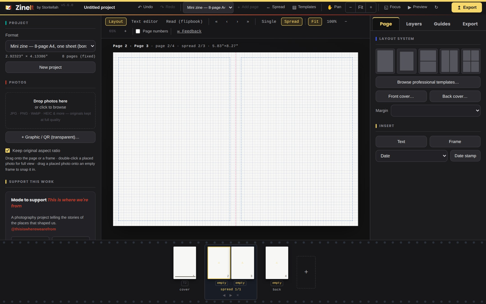

  

<h1 align="center">Zineit by Storitellah</h1>

  <b>Make print-ready zines &amp; photobooks — right in your browser, all on your device.</b>

  
  
  

  
  
  
  
  

  

---

**ZineIt** is a free, local-first layout tool for photographers and photojournalists. Drop
in your photos, arrange them, and export something you can actually print — a folded
mini-zine, a saddle-stitched booklet, or a photobook.

It's one HTML file. **No account, no upload, no cloud.** Your photos never leave your
computer, and your originals are never touched.

👉 **[Open ZineIt at zineit.app](https://zineit.app)** &nbsp;·&nbsp; **[See the showcase page](https://storitellah.github.io/zineit/)**

## ✨ Highlights

- 📐 **Real formats** — A4 mini-zines, photobooks and saddle-stitch booklets, with fold and cut guides that line up.
- 🖼️ **Photos, never stretched** — frames crop; your pictures always keep their true shape.
- 📄 **One-click A4 PDF** — export a 300 DPI, print-ready mini-zine, named after your project.
- 🎨 **Panoramas** — run one photo across a spread, several pages, or the whole cover.
- 📖 **Flipbook reader** — page through your zine like a real book, in double-page spreads, with a QR code to keep reading on your phone.
- 🖌️ **Transparent artwork** — logos, QR codes and signatures with real transparency, no white box.
- 🔒 **Yours, offline** — works from a file, on a plane, forever. Backs up to a small file you keep.
- 📱 **Phone &amp; tablet ready** — the whole thing works in mobile browsers.

## 🚀 Quick start

1. Open **[zineit.app](https://zineit.app)** — or download `index.html` and open it in any browser.
2. **Drop your photos** in. They stay full quality; your originals aren't altered.
3. **Pick a format**, arrange your pages, add text and logos.
4. **Read it** in the flipbook, then **export** a 300 DPI PDF.

That's it — no sign-up, nothing to install.

### Make your first zine

Choose the **A4 mini-zine** format (the default), drop in eight photos, and each lands on a
page. Add a title on the cover, check it in the **Read (flipbook)** tab, then hit **Download
A4 mini-zine PDF**. Print it double-sided, fold, and cut the one slit — a finished 8-page
zine.

### Photobook workflow

Pick a photobook format for facing-page spreads. Use **panorama** placement to run a single
image across a spread (gutter-aware, never stretched), and the **Layers** panel to stack
artwork over photos.

## 🖨️ Printing well

ZineIt exports clean **300 DPI**, correctly-sized, **bleed-ready** files. For CMYK with a
specific ICC profile (**Coated GRACoL 2006 / FOGRA39**), open the export in a prepress tool
like Affinity Publisher, Scribus (free) or Acrobat and convert there — the in-app **Print &amp;
colour** panel explains how, including standard vs rich black and bleed. Browsers are
RGB-only, so ZineIt is honest about that rather than faking colour.

## 📱 Mobile

Works in Chrome, Safari and Brave on iPhone, iPad and Android. Touch-friendly targets,
bottom-sheet panels, pinch-to-zoom, a centred preview, and the Android back button closes
what's open instead of leaving the app. Install it to your home screen as a PWA.

## 📄 Supported formats

Mini-zine (A4, 8-page), photobooks, and saddle-stitch booklets, with more paper sizes and an
A3 workflow on the [roadmap](docs/ROADMAP.md).

## ⌨️ Keyboard shortcuts

| Key | Action |
| --- | --- |
| `Ctrl/⌘ + Z` / `Shift+Z` | Undo / redo |
| `Ctrl/⌘ + S` | Save backup (.bak) |
| `← / →` | Turn pages in the flipbook |
| `Delete` | Remove the selected element |
| `Esc` | Close panels / exit focus mode |

## 🗺️ Roadmap

See **[docs/ROADMAP.md](docs/ROADMAP.md)** — it tracks what's shipped, what's partial, and
what's next (a dedicated Artwork layer type, more paper sizes and an A3 workflow, more
templates and layouts, a resizable timeline, and a performance pass).

## 🧩 Also in this repo

- **Lightroom plugin** (`lightroom/`) — send selects straight into a zine.
- **Android project** (`android/`) — build the app as an APK ([guide](docs/ANDROID-BUILD.md)).
- **Docs** (`docs/`) — hosting on Cloudflare, the mini-zine format, templates, and more.

## 🤝 Contributing

Issues and ideas are welcome — open one on GitHub, or email
[hello@storitellah.com](mailto:hello@storitellah.com). The app is a single `index.html`; the
test suite (jsdom + Lua) runs with `./tests/run-tests.sh` and must pass before a release.

## 📝 Changelog

See **[CHANGELOG.md](CHANGELOG.md)** for the full history.

## 📜 License

© Storitellah. All rights reserved unless a license file is added to this repository. If
you'd like to reuse or adapt ZineIt, please get in touch at
[hello@storitellah.com](mailto:hello@storitellah.com).

## 🙏 Credits

Built by **[Storitellah](https://storitellah.com)** — independent photojournalism from
Nairobi. Questions? **[hello@storitellah.com](mailto:hello@storitellah.com)**

---

  Your photos never leave your device. Free &amp; open. Made for people who print.

