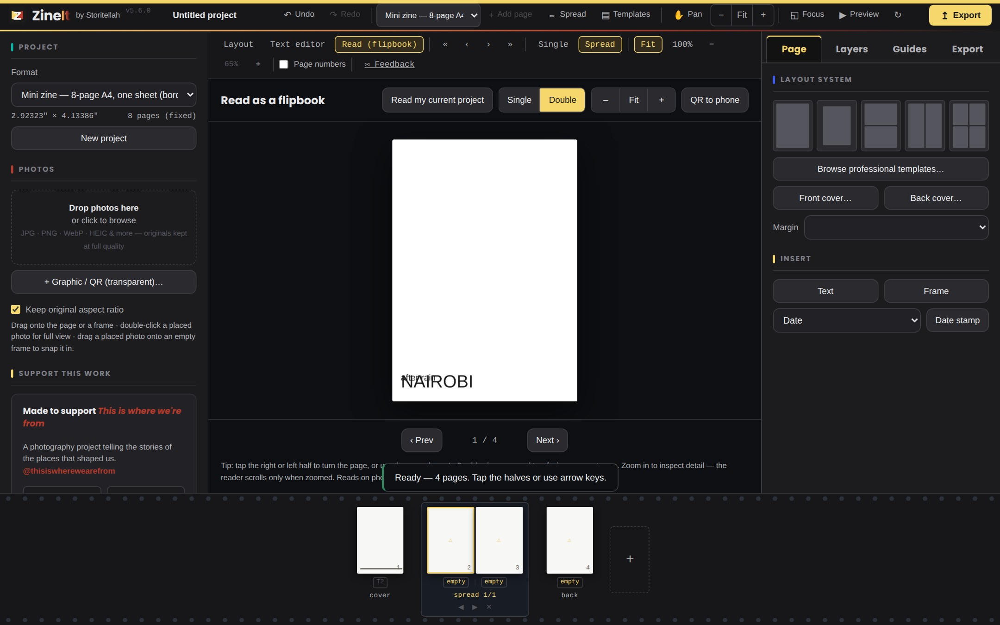
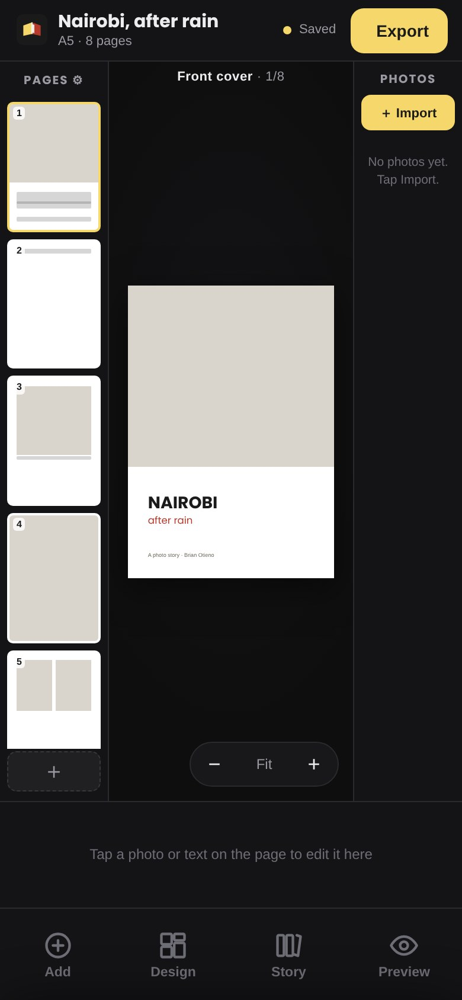

<p align="center">
  
</p>

<h1 align="center">ZineIt</h1>

<p align="center">
  <b>Make print-ready zines &amp; photobooks — right in your browser, all on your device.</b><br>
  <sub>by <a href="https://instagram.com/storitellah">Storitellah</a> · a single HTML file · no accounts · no uploads · works offline</sub>
</p>

<p align="center">
  <a href="https://zineit.app"></a>
  
  
</p>

<p align="center">
  
  
  
  
  
</p>

<p align="center">
  
</p>

<p align="center">
  <sub>🧡 Made to support <a href="https://instagram.com/thisiswherewearefrom"><b><i>This is where we're from</i></b></a> — a photography project telling the stories of the places that shaped us.</sub>
</p>

---

## What it is

**ZineIt turns your photographs into something you can fold, print, and hold.** It's a layout tool for photographers and photojournalists that runs entirely in your browser — drop in your photos, arrange them, and export a folded mini-zine, a saddle-stitched booklet, or a photobook. Your originals never leave your device.

No sign-up. No cloud. No subscription. Open the page and start.

<table>
<tr>
<td width="50%" valign="top">

### 🎞️ Built for photo stories
- Full-bleed, spreads, grids, contact sheets
- A rich **template library** — front covers, inner pages, and back covers
- **Themes** you can apply and then edit, Canva-style
- Transparent PNG / logo / QR support — no white box, ever

</td>
<td width="50%" valign="top">

### 🖨️ Honest about print
- Everything renders at **300 DPI** from your originals
- **Foldable single-sheet mini-zines** on A3, A4, and US Letter
- Illustrated **"How to fold"** guide, one fold and one cut
- Bleed-ready files a print shop can work from

</td>
</tr>
</table>

---

## Foldable mini-zines, one sheet

Pick a mini-zine format and ZineIt imposes your eight pages onto **one sheet** — print it, fold it, cut once, and you have a zine.

- **Print the Zine** — sends the imposed sheet straight to your printer with fold and cut marks.
- **Download** — one-click PDFs at 300 DPI in **A3, A4, US Letter, and A5**.
- **How to fold** — a six-step illustrated guide, right in the export dialog.

<p align="center">
  
</p>

---

## Designed for the desk and the field

The whole tool works in mobile browsers too — Chrome, Safari, Brave — with a layout that adapts to phones and tablets without hiding the tools you need. Install it to your home screen and it runs like an app, fully offline.

<p align="center">
  
</p>

---

## Your first zine in four steps

1. **Open ZineIt** — go to [zineit.app](https://zineit.app) or open `index.html`. No sign-up.
2. **Drop your photos** — they stay on your device, at full quality.
3. **Lay out the pages** — pick a format, choose a template, add text, snap everything to the grid.
4. **Export &amp; print** — one-click A4 mini-zine PDF at 300 DPI, or Print the Zine and fold.

---

## Brand

ZineIt's identity is **"Butter &amp; Tomato"** — a two-accent system on ink and paper.

| | Name | Hex | Use |
|---|------|-----|-----|
| 🟡 | **Butter Pop** | `#F6D76B` | Primary accent — on dark surfaces (14.85:1 on ink) |
| 🔴 | **Tomato Vinyl** | `#B63A2B` | Action / secondary — on light surfaces (5.79:1 on paper, AA) |
| ⬛ | **Ink** | `#1A1A1A` | Text, dark UI, logo ground |
| ⬜ | **Paper** | `#F7F7F5` | Page background, text on dark |

The mark is a bold **Z that opens like a book** — two pages (butter and tomato) fanning from a spine, on an ink tile.

---

## Privacy &amp; how it works

ZineIt is a **single HTML file**. Everything — layout, imposition, PDF export — happens locally in your browser. Your photos are read into memory and written into the files you export; they are never uploaded anywhere. Backups (`.bak`) are yours to keep, and you can restore them on any device.

- **Full backup** — one self-contained file with every photo embedded.
- **Light backup** — kilobytes; remembers your layout and relinks to your photo files later.

---

## Run it yourself

It's one file — no build step.

```bash
git clone https://github.com/storitellah/zineit.git
cd zineit
# open index.html in any modern browser, or serve it:
python3 -m http.server 8080   # then visit http://localhost:8080
```

The test suite is plain Node + jsdom:

```bash
cd tests
npm install jsdom
node run-tests.js
```

---

## Links

- 🌐 **App:** [zineit.app](https://zineit.app)
- 📸 **Storitellah:** [@storitellah](https://instagram.com/storitellah)
- 🧡 **This is where we're from:** [@thisiswherewearefrom](https://instagram.com/thisiswherewearefrom)
- ✉️ **Feedback:** hello@storitellah.com

<p align="center"><sub>Built by Storitellah · free &amp; open · your photos never leave your device.</sub></p>
